# ios-contact-manager-ui

> 연락처 관리 앱

## 🙋 팀원

## 📁 디렉토리 구조

```markdown
.
├── AppDelegate.swift
├── Assets.xcassets
│   ├── AccentColor.colorset
│   │   └── Contents.json
│   ├── AppIcon.appiconset
│   │   └── Contents.json
│   └── Contents.json
├── Contacts.json
├── Controllers
│   ├── ContactsViewController.swift
│   └── NewContactViewController.swift
├── Extension
│   └── StringExtension.swift
├── Info.plist
├── Models
│   ├── AlertKind.swift
│   ├── Contact.swift
│   ├── ContactManager.swift
│   ├── ContactsError.swift
│   └── Validatable.swift
├── SceneDelegate.swift
└── Views
    ├── Base.lproj
    │   ├── LaunchScreen.storyboard
    │   └── Main.storyboard
    └── ContactCell.swift
```

## 🧷 클래스 다이어그램

```mermaid
classDiagram

class AlertKind {
	<<Enumeration>>
	case cancel(title: String, actions: [UIAlertAction])
	case error(type: Error, action: UIAlertAction)

	+ configureAlertController() -> UIAlertController
}

class ContactManager {
	- var contacts: [Contact]
	+ var contactsCount: Int
	+ var add(contact: Contact) -> ObjectIdentifier
	+ update(for id: ObjectIdentifier, with info: ContactInfo)
	+ deleteContact(by id: ObjectIdentifier)
	+ showContact(index: Int) -> Contact
	+ fetchIndexOfContact(with id: ObjectIdentifier) -> Int?
	+ fetchContactsContains(with name: String) -> [Contact]
	- sortContactsByName()
}

class Contact {
	- var name: String
	- var age: String
	- var phoneNumber: String

	+ init(info: ContactInfo)

	+ update(with info: ContactInfo)	
}

class Validatable {
	<<Protocol>>
	+ verifyName(name: String) -> Bool
	+ verfiyAge(age: String) -> Bool
	+ verfiyNumber(phoneNumber: String) -> Bool
}

class ContactsError {
	<<Enumeration>>
	case invalidPhoneNumber
	case invalidAge
	case invalidName
	+ description: String
}

class ContactsViewController {
	+ var contactsTableView: UITableView!
	+ var searchBar: UISearchBar!

	- contactManager: ContactManager
	- cellIdentifier: String
	- newContactVCIdentifier: String
	- isSearching: Bool
	- searchingName: String
	
	+ IBAction addButtonTapped(_ sender: UIBarButtonItem)
	
	+ tableView(_ tableView: UITableView, numberOfRowsInSection section: Int) -> Int 
	+ tableView(_ tableView: UITableView, cellForRowAt indexPath: IndexPath) -> UITableViewCell
	+ tableView(_ tableView: UITableView, didSelectRowAt indexPath: IndexPath)
	+ tableView(_ tableView: UITableView, editingStyleForRowAt indexPath: IndexPath) -> UITableViewCell.EditingStyle
	+ tableView(_ tableView: UITableView, commit editingStyle: UITableViewCell.EditingStyle, forRowAt indexPath: IndexPath)
	
	- setDummyData()
	
	+ didContactsChanged(_ contactId: ObjectIdentifier)
	+ didContactsAdded(_ contactId: ObjectIdentifier)
	
	+ searchBar(_ searchBar: UISearchBar, textDidChange searchText: String)
}

class ContactsTableViewUpdateDelegate {
	<<Protocol>>
	+ didContactsAdded(_ contactId: ObjectIdentifier)
	+ didContactsChanged(_ contactId: ObjectIdentifier)
}

class NewContactViewController {
	+ @IBOutlet var nameTextField: UITextField
	+ @IBOutlet var ageTextField: UITextField
	+ @IBOutlet var phoneNumberTextField: UITextField

	- var contactManager: ContactManager
	- var delegate: ContactsTableViewUpdateDelegate
	+ var contact: Contact
	- private let hypen: Character

	- setUpUI()
	+ @IBAction phoneNumberTextFieldEditingChanged(_ sender: UITextField)
	+ @IBAction cancelButtonTapped(_ sender: UIBarButtonItem)
	+ @IBAction saveButtonTapped(_ sender: UIBarButtonItem)
	
	+ configureData(_ contactManager: ContactManager?, delegate: ContactsTableViewUpdateDelegate?, contact: Contact? = nil)
	
	- makeCheckedInfo() throws -> ContactInfo 
}

NewContactViewController --> ContactsTableViewUpdateDelegate
NewContactViewController --> ContactsError: throws
NewContactViewController --> Validatable: 상속
NewContactViewController --> AlertKind

ContactsViewController ..> ContactsTableViewUpdateDelegate: 구현
ContactManager --> Contact: 소유

class ContactCell {
	+ var nameLabel
	+ var ageLabel
	+ var phoneNumber
	
	+ var contact: Contact?

	+ awakeFromNib()

	+ configureCell(with: contact: Contact)
}
```



## 🧷 모델 구현 내용

| 이름 | 타입 | 구현내용 |
| --- | --- | --- |
| ContactCell | final Class | custom Cell을 구현해 주었고 contact 파라미터를 받아서 storyboard의 UILabel에 매칭해준다. |
| ContactsViewController | final Class | ContactManager()을 구현하여 tablewView에 연락처를 보여주고 addButton을 클릭하면 NewContactViewController로 이동하여 연락처 추가 창으로 이동합니다. |
| NewContactViewController | final Class |  |
| ContactsTableViewUpdateDelegate | protocol | AnyObject를 따르는 커스텀 델리게이트 패턴을 구현 |
| AlertKind | enum | 프로그램 내에서 알림창을 띄울 수 있는 경우에 대해 정의 |
| ContactManager | final Class | contact의 배열을 가지고 contact의 count, 연락처 추가, 연락처 수정, 연락처 삭제, 연락처 반환  연락처 index 반환, 연락처 이름 순 정렬 등의 기능을 구현 |
| Contact | final Class | 연락처 클래스 |
| Validatable | protocol | 표현식을 사용해 입력된 이름, 나이, 연락처 항목이 입력형식에 맞는지 판별 |
| ContactsError | enum | 연락처의 입력 형식에 오류시 Alert에 해당 오류 내용을 반환 |

## 📱 동작화면

### 연락처 추가 및 검색

### 연락처 수정

### 연락처 삭제

### Dynamic Type 적용

# 🚀 Trouble Shooting

[연락처 관리 앱 [Step1] bello, mango by JinUng41 · Pull Request #23 · tasty-code/ios-contact-manager-ui](https://github.com/tasty-code/ios-contact-manager-ui/pull/23)

[연락처 관리 앱 [STEP 2] bello, mango by Dongjun-developer · Pull Request #33 · tasty-code/ios-contact-manager-ui](https://github.com/tasty-code/ios-contact-manager-ui/pull/33)

[연락처 관리 앱 [STEP 3] bello, mango by JinUng41 · Pull Request #40 · tasty-code/ios-contact-manager-ui](https://github.com/tasty-code/ios-contact-manager-ui/pull/40#issue-1951037727)

## 전화번호를 입력하기 위한 `-`을 삽입하는 방법

- 프로젝트 요구사항에서는 `-`을 사용하여 전화번호가 저장될 수 있게끔 요구하고 있습니다.
- 텍스트 필드를 `@IBAction`의 `Editing Changed`로 하여 입력이 발생할 때마다 `-`을 삽입하려 하였습니다.
- 텍스트 필드에 입력된 내용에서 `-`을 지우기 위해 `replacingOccurrendces(of:with)`메서드를 사용하여 `-`을 빈 문자열로 바꾸어 주었습니다.
- 그 후에 남은 문자열 (즉, 번호)에 대해서 문자의 개수를 가지고 비교하여 해당하는 위치에 `-`을 다시 삽입하였습니다.
    - 저장될 수 있는 전화번호의 조건은 다음과 같이 정하였습니다.
        - 전화번호의 시작은 무조건 0이다.
        - 저장될 수 있는 전화번호의 예시는 다음과 같다.
            - “02-408-2911” → 9자리
            - “031-123-9589” → 10자리
            - “010-4898-9567” → 11자리
- 새로운 위치에 `-`을 삽입하는 방법은 `String`의 extension으로 구현하였습니다.

## 커스텀 델리게이트 패턴을 구현할 때, `AnyObject`을 따르는 이유

- `AnyObject`의 공식문서를 보면 다음과 같이 설명하고 있습니다.
    
    > The protocol to which all classes implicitly conform.
    모든 클래스(타입을) 암시적으로 준수하는 프로토콜이다.
    > 
- 클래스는 Reference Type으로서, 메모리의 Heap 영역에 저장되고 Stack 영역에서 참조하는 방식으로 저장이 이루어 집니다.
- ARC라는 Swift의 메모리 관리 시스템에서 참조 횟수가 0이여야 Heap 영역에 할당된 클래스의 인스턴스가 안전하게 해제 됩니다.
- 그러한 클래스 타입으로 선언되는 뷰컨트롤러는 커스텀 델리게이트 패턴을 구현하려 할 때, 강한 참조 사이클 `weak` 키워드를 사용합니다.
- 반대로 구조체, 열거형은 Value Type으로 그 인스턴스 자체가 메모리의 Stack 영역에 저장되며, 참조가 일어나지 않습니다.
- 커스텀 델리게이트 패턴을 구현을 위한 프로토콜을 정의를 할 때, 프로토콜은 어떠한 타입이든 채택할 수 있게 됩니다.
- 하지만 이 때 `weak` 키워드를 통해 프로토콜을 따르는 어떠한 타입의 인스턴스를 저장한다고 할 때, 프로토콜은 `AnyObject`를 채택해야 한다는 오류 메세지를 살펴볼 수 있습니다.
- 참조 횟수를 다루는 클래스의 인스턴스를 저장한다는 의미이며, Value Type은 `weak` 키워드를 사용할 수 없습니다.
    - Value Type은 참조 횟수를 다루지 않기 때문입니다.
- 그렇기 때문에 커스텀 델리게이트 패턴을 위한 프로토콜은 클래스만이 따를 수 있는 `AnyObject`를 채택하여 해당 프로토콜이 클래스에서만 사용될 수 있음을 명시해야 합니다.

## UITableView의 `reloadData()` 외 다른 방법 찾아보기

- tabelView에 연락처가 삭제될 때, 연락처 내용이 변경 될때 , 새로운 연락처가 추가 되었을 때 tablewView을 변경이 필요
    
    > 하나의 변경 사항이 발생할 때 마다 tableView 전체를 모두 새로고침 하는 경우 메모리 낭비가 발생하기에 `reloadData`
    > 
    > 
    > 을 최대한 사용하지 않으려고 하였다.
    > 
    - `reloadData` 외의 방식을 사용한 경우
        - add 시 `insertRows()`  을 사용하여 해당 셀을 삽입한다.
        - delete 시 삭제한 cell의 id로 tableview에서 찾아서 cell을 찾아서 `deleteRows()` 을 사용하여 삭제한다.
    - `reloadData` 를 사용한 경우
        - searchBar에서 이름 검색하는 경우
        - 연락처 내용 수정의 경우

## **`insertRows`, `deleteRows` 메서드들은 내부적으로 연산 전/후의 셀 개수를 비교하는가..**

- 테이블뷰의 특정 셀을 삭제하는 부분에서  만약 실제 데이터(연락처 배열)에서는 삭제를 하지 않고, 테이블뷰에서만 행을 삭제하려 했을 때 다음과 같은 오류를 확인할 수 있었습니다.
    - Thread 1: "Invalid batch updates detected: the number of sections and/or rows returned by the data source before and/or after performing the batch updates are inconsistent with the updates.\nData source before updates = { 1 section with row counts: [30] }\nData source after updates = { 1 section with row counts: [29] }\nUpdates = [\n\tDelete row (0 - 0),\n\tInsert row (0 - 0)\n]\nTable view: <UITableView: 0x13081d200; frame = (0 153.667; 393 664.333); clipsToBounds = YES; autoresize = RM+BM; gestureRecognizers = <NSArray: 0x600002978f60>; backgroundColor = <UIDynamicSystemColor: 0x600003277580; name = tableBackgroundColor>; layer = <CALayer: 0x600002786000>; contentOffset: {0, 0}; contentSize: {393, 1698.6666666666665}; adjustedContentInset: {0, 0, 0, 0}; dataSource: <ios_contact_manager_ui.ContactsViewController: 0x12f31d240>>”
    - 오류 메세지를 통해 이해한 내용은 ‘업데이트를 수행하기 전 또는 후에 데이터 원본에서 반환한 섹션, 행 수가 업데이트와 일치하지 않는다’ 입니다.
- 오류 메세지를 통해 추측한 것은 셀의 CRUD를 수행할 때에도 내부적으로 행의 개수와 원본 데이터의 개수를 비교하여 테이블뷰의 안전성?을 추구하는 것으로 이해하였습니다.
